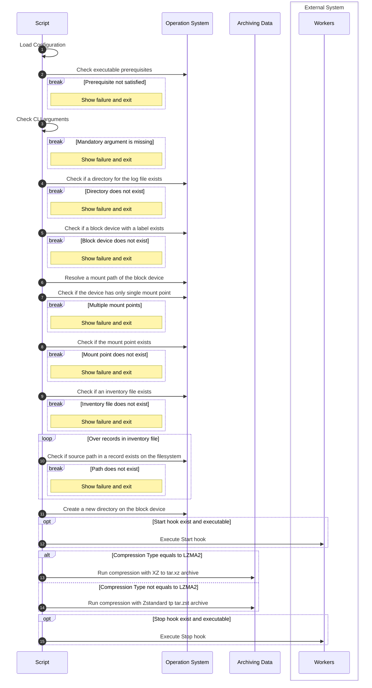

# Shell Script for Cold Backups


- [Description](#description)
- [Functionality](#functionality)
- [Prerequisites](#prerequisites)
- [Execution Sequence](#execution-sequence)
- [Running the Backup Job](#running-the-backup-job)
   * [General Approach](#general-approach)
   * [Inventory File](#inventory-file)
   * [CPU Utilization by Archiving Job](#cpu-utilization-by-archiving-job)
   * [Configuration File](#configuration-file)
   * [Hooks Subsystem](#hooks-subsystem)

## Description

A simple tool to create cold <u>unencrypted</u> backups to a local block device.

## Functionality

* Archiving files and directories recursively
* Definition of compression type using configuration:
   * Zstd (default)
   * LZMA2
* Use `inventory` files to define targets for archiving
* Hooks for `start`, `end`, and `abort` archiving process events
* Notifications about `start`, `end`, and `abort` of archiving process:
   * Telegram
   * Ntfy
* Automatic block device mounting path resolution by the block device label
* Automatic allocation of `maximum-1` available CPU cores in the system for the compression process

> [!IMPORTANT]
> Backup script does not have a retention policy nor free space capacity pre-check. Please consider to check free space on the device in advance.

## Prerequisites

* Labeled and mounted local block device
* Device for backups has enough free space
* The user running the script can create directories and files on the mount point of the block device
* The user running the script can create logs files at the specified log path
* The following utils are installed or available as built-in from shell:
   * curl
   * date
   * dirname
   * findmnt
   * grep
   * hostname
   * mkdir
   * readlink
   * tee
   * xz
   * zstd

## Execution Sequence


## Running the Backup Job

### General Approach
The backup script has the following CLI arguments:
```shell
~> ./backup-cold.sh
usage: ./backup-cold.sh options

OPTIONS:
   -h      Show this message
   -b      Path to inventory file containing backup targets. Default: None. Mandatory.
   -d      LABEL of disk used for cold backups. Default: None. Mandatory.
   -l      Path to log file. Default: /home/fd/git/github/backup-cold/<unix_timestamp>.log
```
Operator require to provide mandatory `-b` and `-d` arguments. For example:
```shell
~> ./backup-cold.sh -b /path/to/inventory_file -d block_device_label
```

After that script will automatically perform several check and create a directory path as `/<block_device_mount_point>/<host_fqdn>/<unix_epoch_timestamp>`.


### Inventory File
The `inventory` file has the following structure:
```
<target_archive_1_filename_without_extension>|<source_path_1_on_the_filesystem>::<source_path_2_on_the_filesystem>
<target_archive_2_filename_without_extension>|<source_path_3_on_the_filesystem>::<source_path_4_on_the_filesystem>
```

For example,
```
__etc|/etc
__home|/home/user1::/home/user2
__usr|/usr/lib/systemd/systemd-service-name.service::/usr/lib/systemd/systemd-service-name.timer::/usr/local/bin
```

will produce 3 archives (assuming the Zstandard compression is used):
* `/<block_device_mount_point>/<host_fqdn>/<unix_epoch_timestamp>/__etc.tar.zst` that contains data of `/etc` directory
* `/<block_device_mount_point>/<host_fqdn>/<unix_epoch_timestamp>/__home.tar.zst` that contains data of 2 directories `/home/user1` and `/home/user2`
* `/<block_device_mount_point>/<host_fqdn>/<unix_epoch_timestamp>/__usr.tar.zst` that contains data of 2 files `/usr/lib/systemd/systemd-service-name.service`, `/usr/lib/systemd/systemd-service-name.timer`, and 1 directory `/usr/local/bin`

### CPU Utilization by Archiving Job
Archiving job consumes `maximum-1` number of logical CPUs available to the Operation System.
Only one job runs at a time.
To plan the archiving timing, please also consider that each archiving job uses maximum compression ratio:
 * Zstandard: --ultra -22
 * LZMA2: -9e


### Configuration File
The configuration file `backup-cold.cfg` must be located in the same directory as the script.
The following list of variables is supported:
* __COMPRESSION_TYPE__ - Specify the compression type, possible values: `ZSTD` and `LZMA2`. Default value if not set: `ZSTD`.
* __NTFY_SERVER__ - Specify Ntfy server, can be either private or public. Default value: None.
* __NTFY_TOPIC__ - Specify an individual or multiple comma separated topics on Ntfy server. Default value: None.
* __NTFY_TOKEN__ - Specift Ntfy token to access the topic. Default value: None.
* __TELEGRAM_BOT_TOKEN__ - Specify Telegram bot token, please see [official documentation](https://core.telegram.org/bots/features#botfather). Default value: None.
* __TELEGRAM_CHAT_ID__ - Specify Telegram chat ID to send the notification, please see [unofficial documentation](https://gist.github.com/nafiesl/4ad622f344cd1dc3bb1ecbe468ff9f8a). Default value: None.

### Hooks Subsystem

There is a built-in subsystem of hooks for `Backup Start`, `Backup End`, and `Abort` (aka INT, SIGHUP, SIGINT, SIGTERM signals) events.

Each hook is a dedicated executable that can contain custom business logic to invoke the interaction with external systems, e.g. notifications via Telegram, Ntfy, etc., or running different async workers for automation. Each executable hook accepts one argument - current archiving path.

Current version is supplied with hooks as shell scripts for sending notifications to Telegram and/or Ntfy. To enable, you need provide correct credentials to the [Configuration file](#configuration-file).